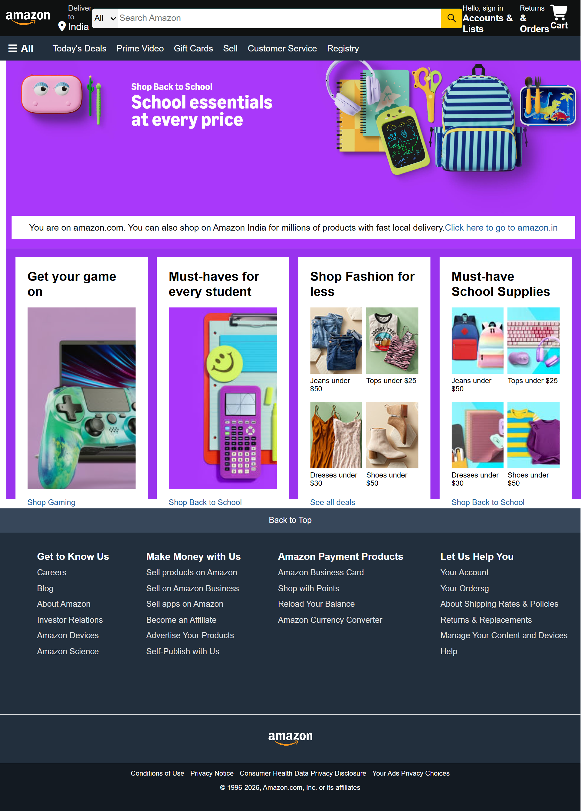

# 🛒 Amazon Clone

A frontend clone of the Amazon homepage built using **HTML5** and **CSS3**.  
This project was created to practice responsive layouts, Flexbox, CSS styling, and real-world webpage structure.

---

## 📸 Project Screenshot



---

## 🚀 Features

- Amazon-style navigation bar
- Search bar
- Hero banner section
- Shopping/product cards
- Multi-column footer
- Hover effects
- Clean and organized layout

---

## 🛠️ Technologies Used

- HTML5
- CSS3

---

## 📂 Project Structure

```text
amazon-clone/
│── images/
│── screenshots/
│   └── amazon-clone.png
│── index.html
│── style.css
├── README.md
```

---

## 💡 What I Learned

While building this project, I practiced:

- Structuring webpages using HTML
- Styling layouts with CSS
- Using Flexbox for alignment
- Working with images and backgrounds
- Creating reusable CSS classes
- Maintaining a project using Git and GitHub

---

## ▶️ How to Run

1. Clone this repository:

```bash
git clone https://github.com/akashsingh1104/amazon-clone.git
```

2. Open the project folder.

3. Open `index.html` in your browser.

---

## 👨‍💻 Author

**Akash Singh**

GitHub: https://github.com/akashsingh1104

---

⭐ If you like this project, consider giving it a star!